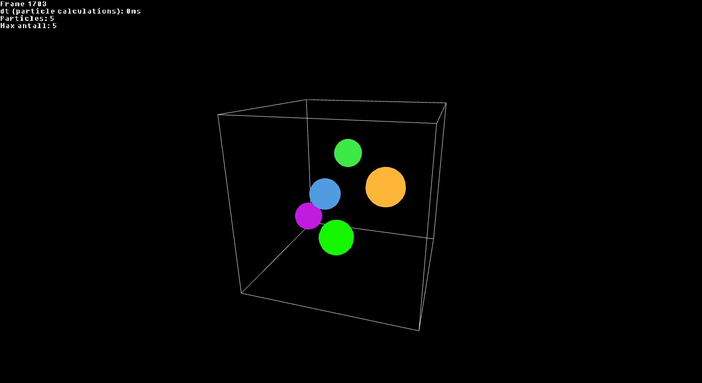
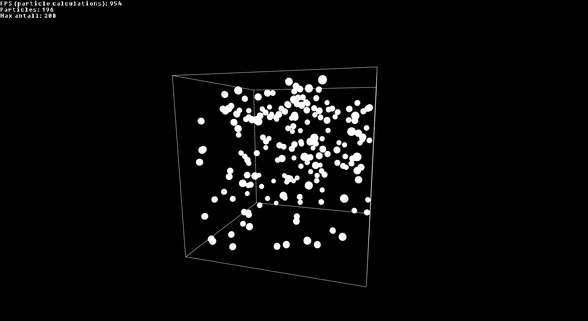
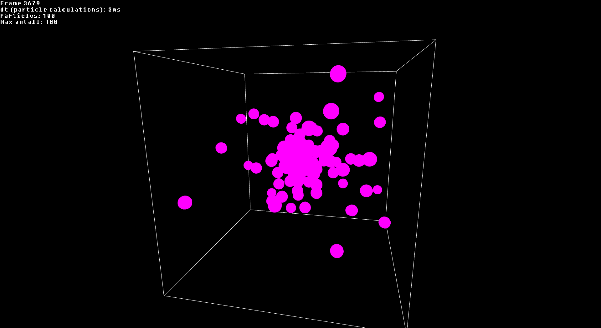

Kandidatnr: 10051

# 3D Particle Simulator (Work in progress)

This is a physically based simulator that renders and simulates particle collision and gravity in 3D.
The project is largely based on a previous project of mine for a similar simulation in 2D. The previous project is not avalible on github, but you can find some examples here: 

https://www.youtube.com/@oysteinmb1

https://youtu.be/nWXFzZYENKg

https://youtu.be/U52HS8rBsdI

The README file is in large part inspired by the readme of threepp.
https://github.com/markaren/threepp/tree/master

### Current state
As of 11.12.23 the simulation library is in working condition. It still needs a lot in terms of being user firendly, and a lot of optimization.

### How to build?
This simulation uses threepp to render. The easiest way to get it up and working is proably to use vcpkg in manifest mode.

First, call CMake with this command: 

    -DCMAKE_TOOLCHAIN_FILE=[path to vcpkg]/scripts/buildsystems/vcpkg.cmake
    
Then when building with MinGW you will need these in the CMake profile

    -DVCPKG_TARGET_TRIPLET=x64-mingw-[DYNAMIC|STATIC] # Choose either static OR dynamic
    -DVCPKG_HOST_TRIPLET=x64-mingw-[DYNAMIC|STATIC]   # Only needed if MSVC cant be found

### Notes on implementation
This simulation is built to act as an 80% physically based simulation, and 20% visually belivable/pleasing. This means that some of the friction and gravity calculation will not be 100% physicly accurate. This simulation also uses verlet integration, witch is also not perfectly accurate.

### Controls
You can change the max number of particles during runtime by using the "U" and "I" keys. You can also move the spawning point by using WASDQE keys. To see the spawn point of particles hold "G"

### Examples

